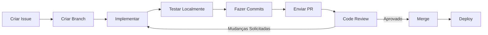

# Guia de Contribuição e Padrões de Código

Diretrizes para contribuir ao projeto First API Go, mantendo qualidade e consistência.

---

## 📑 Índice

1. [Code of Conduct](#code-of-conduct)
2. [Como Contribuir](#como-contribuir)
3. [Padrões de Código](#padrões-de-código)
4. [Convenções de Naming](#convenções-de-naming)
5. [Estrutura de Commits](#estrutura-de-commits)
6. [Pull Requests](#pull-requests)
7. [Testes](#testes)
8. [Documentação](#documentação)

---

## Code of Conduct

### Princípios

- **Respeito**: Trate todos com respeito e profissionalismo
- **Inclusão**: Todos são bem-vindos independentemente de background
- **Colaboração**: Trabalhe juntos para melhores soluções
- **Qualidade**: Mantenha altos padrões de código

### Comportamento Inaceitável

- Assédio de qualquer tipo
- Discriminação
- Linguagem abusiva
- Desrespeito

**Reportar problemas:** [abrir issue privada]

---

## Como Contribuir

### Pré-requisitos

- Go 1.25.4 ou superior
- PostgreSQL 12+
- Redis 6+
- RabbitMQ 3.8+
- Git

### Setup Inicial

```bash
# 1. Fork o repositório
https://github.com/EmersonRabelo/first-api-go/fork

# 2. Clone seu fork
git clone https://github.com/seu-username/first-api-go.git
cd first-api-go

# 3. Adicionar upstream
git remote add upstream https://github.com/EmersonRabelo/first-api-go.git

# 4. Criar branch
git checkout -b feature/sua-feature

# 5. Instalar dependências
go mod download

# 6. Verificar tudo funciona
go build ./cmd/api
```

### Tipos de Contribuição

#### Bug Fixes

```bash
# Criar issue descrevendo o bug
# Comentar na issue que você vai trabalhar
# Criar branch: git checkout -b fix/issue-123
# Implementar fix com testes
# Enviar PR referenciando a issue
```

Exemplo:
```bash
git checkout -b fix/invalid-email-validation
# Implementar fix
git commit -m "fix: corrigir validação de email em CreateUserRequest #123"
git push origin fix/invalid-email-validation
# Abrir PR
```

#### Novas Features

```bash
# 1. Discussão na issue (opcional para small features)
# 2. Criar branch feature
git checkout -b feature/novo-filtro-posts

# 3. Implementar com testes
# 4. Enviar PR com descrição detalhada
```

#### Melhorias de Documentação

```bash
# Branch para docs
git checkout -b docs/adicionar-guia-deployment

# Editar arquivos em docs/
# Commit e PR
```

#### Refactoring

```bash
# Branch para refactor
git checkout -b refactor/simplificar-post-service

# Fazer refactoring sem alterar comportamento
# Adicionar testes se não existem
# PR com justificativa
```

---

## Padrões de Código

### Go Style Guide

Seguimos [Effective Go](https://golang.org/doc/effective_go) e [Google Go Style Guide](https://google.github.io/styleguide/go/).

#### 1. Formatação

```bash
# Usar gofmt
gofmt -s -w .

# Ou via VS Code (automático ao salvar com gopls)
```

#### 2. Nomes

**Pacotes:**
```go
// ✅ Bom
package user
package config

// ❌ Ruim
package user_handler
package config_utils
```

**Funções públicas:**
```go
// ✅ Bom
func CreateUser(...)
func FindByID(...)
func ValidateEmail(...)

// ❌ Ruim
func create_user(...)
func findbyid(...)
func validate_email(...)
```

**Funções privadas:**
```go
// ✅ Bom
func (s *userService) createHash(password string) string

// ❌ Ruim
func (s *userService) CreateHash(password string) string
```

**Constantes:**
```go
// ✅ Bom
const (
    MaxEmailLength = 255
    DefaultTimeout = 30 * time.Second
)

// ❌ Ruim
const (
    max_email_length = 255
    defaultTimeout = 30 * time.Second
)
```

**Variáveis:**
```go
// ✅ Bom
var (
    userRepository repository.UserRepository
    err error
)

// ❌ Ruim
var (
    user_repo repository.UserRepository
    errUser error
)
```

#### 3. Interfaces

```go
// ✅ Bom - nomes descritivos, sem prefixo "I"
type PostRepository interface {
    Create(ctx context.Context, post *Post) error
    FindByID(ctx context.Context, id uuid.UUID) (*Post, error)
    Update(ctx context.Context, post *Post) error
    Delete(ctx context.Context, id uuid.UUID) error
}

// ❌ Ruim
type IPostRepository interface {
    C(ctx context.Context, post *Post) error
    F(ctx context.Context, id uuid.UUID) (*Post, error)
}
```

#### 4. Receivers

```go
// ✅ Bom - usar pointer para mutações
func (r *userRepository) Save(user *User) error {
    return r.db.Save(user).Error
}

// ✅ Bom - usar value se não muta
func (u User) GetFullName() string {
    return fmt.Sprintf("%s", u.Name)
}

// ❌ Ruim - inconsistente
func (u *User) GetFullName() string {
    return u.Name
}
```

#### 5. Error Handling

```go
// ✅ Bom - erro checking imediato
if err := repository.Create(ctx, post); err != nil {
    log.Printf("falha ao criar post: %v", err)
    return nil, fmt.Errorf("falha ao criar post: %w", err)
}

// ❌ Ruim - ignorar erros
repository.Create(ctx, post) // sem validação

// ❌ Ruim - usar panic
if err != nil {
    panic(err)
}
```

#### 6. Contexto

```go
// ✅ Bom - respeitar contexto
func (s *PostService) CreatePost(ctx context.Context, post *Post) (*Post, error) {
    return s.repository.Create(ctx, post)
}

// ❌ Ruim - ignorar contexto
func (s *PostService) CreatePost(post *Post) (*Post, error) {
    return s.repository.Create(context.Background(), post)
}
```

#### 7. Comentários

```go
// ✅ Bom - comentários significativos
// FindByID retorna um post pelo seu ID.
// Retorna erro se o post não existe.
func (r *postRepository) FindByID(ctx context.Context, id uuid.UUID) (*Post, error) {
    // ...
}

// ✅ Bom - explicar por quê, não o que é óbvio
// Usar UUID em vez de int para evitar enumeration attacks
type Post struct {
    ID uuid.UUID `gorm:"type:uuid;primaryKey"`
}

// ❌ Ruim - óbvio demais
// Incrementar contador
counter++

// ❌ Ruim - comentários desatualizados
// Esta função é chamada quando um usuário clica em curtir
// (Mas agora também é chamada em reações emoji)
func (s *LikeService) CreateLike(...) {
}
```

### Estrutura de Arquivos

#### Dentro de um Pacote

```go
// user_entity.go - Modelos
type User struct {
    ID    uuid.UUID
    Name  string
    Email string
}

// user_repository.go - Interface
type UserRepository interface {
    Create(ctx context.Context, user *User) error
}

// user_repository_impl.go - Implementação
type userRepository struct {
    db *gorm.DB
}

func (r *userRepository) Create(ctx context.Context, user *User) error {
    return r.db.WithContext(ctx).Create(user).Error
}

// user_service.go - Lógica
type UserService struct {
    repository UserRepository
}

func (s *UserService) RegisterUser(ctx context.Context, name, email string) error {
    // validações
    user := &User{
        ID:    uuid.New(),
        Name:  name,
        Email: email,
    }
    return s.repository.Create(ctx, user)
}

// user_handler.go - HTTP Handler
type UserHandler struct {
    service *UserService
}

func (h *UserHandler) Register(c *gin.Context) {
    var req struct {
        Name  string `json:"name" validate:"required"`
        Email string `json:"email" validate:"required,email"`
    }
    
    if err := c.ShouldBindJSON(&req); err != nil {
        c.JSON(400, gin.H{"error": err.Error()})
        return
    }
    
    if err := h.service.RegisterUser(c.Request.Context(), req.Name, req.Email); err != nil {
        c.JSON(500, gin.H{"error": "falha ao registrar"})
        return
    }
    
    c.JSON(201, gin.H{"message": "registrado com sucesso"})
}
```

---

## Convenções de Naming

### Pacotes

```go
// ✅ Bom - simples, descritivo
package user
package post
package report

// Importar
import "github.com/EmersonRabelo/first-api-go/internal/user"
```

### Structs

```go
// ✅ Bom - substantivos
type User struct {}
type Post struct {}
type PostRepository struct {}

// ❌ Ruim - verbos, adjetivos
type UserHandler struct {} // use "Handler" como sufixo, não tipo
type CreatePostInput struct {} // use DTO
type GoodUser struct {} // avoid adjectives
```

### Métodos

```go
// ✅ Bom - verbos descritivos
func (r *repository) FindByID(id uuid.UUID) (*Post, error)
func (s *service) CreatePost(post *Post) error
func (h *handler) List(c *gin.Context)

// ❌ Ruim
func (r *repository) Get(...) // muito genérico
func (s *service) Make(...) // não claro
func (h *handler) Handle(...) // muito genérico
```

### Variáveis

```go
// ✅ Bom
var (
    userRepository UserRepository
    dbConnection   *gorm.DB
    serverPort     string
    isActive       bool
    count          int
)

// ❌ Ruim
var (
    ur UserRepository      // abreviação desnecessária
    db *gorm.DB            // muito genérico em package level
    port string            // ambíguo
    active bool            // falta "is" prefix para booleano
    c int                  // muito curto
)
```

### Constantes e Enums

```go
// ✅ Bom - prefixo descritivo
const (
    StatusPending    = "pending"
    StatusApproved   = "approved"
    StatusRejected   = "rejected"
    
    MaxPostLength    = 280
    DefaultPageSize  = 20
    DefaultTimeout   = 30 * time.Second
)

// ❌ Ruim
const (
    PENDING = "pending"        // SCREAMING_SNAKE_CASE não é Go
    S_APPROVED = "approved"    // prefixo desnecessário
    post_max_len = 280         // snake_case para constante
)
```

---

## Estrutura de Commits

### Convenção Conventional Commits

```
type(scope): subject

body

footer
```

**Tipos:**
- `feat`: Nova funcionalidade
- `fix`: Correção de bug
- `docs`: Alterações em documentação
- `style`: Formatação, sem mudança lógica
- `refactor`: Refatoração de código
- `perf`: Melhorias de performance
- `test`: Adição/alteração de testes
- `chore`: Tarefas de build, dependências
- `ci`: Alterações em CI/CD

**Escopo:**
- Qual parte do código afeta
- Exemplo: `user`, `post`, `report`

### Exemplos

```bash
# ✅ Bom
git commit -m "feat(post): adicionar filtro por tag

- Permite filtrar posts por tag
- Adiciona índice em posts.tags
- Adiciona testes unitários"

# ✅ Bom
git commit -m "fix(auth): corrigir validação de JWT expirado"

# ✅ Bom
git commit -m "refactor(service): simplificar PostService

Quebra o serviço em UserService e PostService
para melhorar coesão"

# ✅ Bom
git commit -m "perf(cache): otimizar queries com Redis

Reduz latência de Like queries de 150ms para 10ms"

# ❌ Ruim
git commit -m "fix stuff"

# ❌ Ruim
git commit -m "Update service.go"

# ❌ Ruim
git commit -m "did some work on post service and cache"
```

---

## Pull Requests

### Template

```markdown
## Descrição
Breve descrição do que foi alterado.

## Problema
O que motiva essa alteração? Link para issue se aplicável.

Closes #123

## Solução
Como você resolveu o problema?

## Testing
Como você testou as mudanças?

- [ ] Testes unitários
- [ ] Testes de integração  
- [ ] Testei manualmente em localhost

## Screenshots/Output (se aplicável)
```

### Checklist Antes de Submeter

- [ ] Código segue os padrões do projeto
- [ ] Sem arquivos desnecessários ou comentados
- [ ] Testes unitários adicionados/atualizados
- [ ] Documentação atualizada
- [ ] Commits têm mensagens descritivas
- [ ] Sem conflitos com main
- [ ] Buildado localmente com sucesso

### Revisor Checklist

- [ ] Código é legível e segue padrões
- [ ] Lógica está correta
- [ ] Tratamento de erros adequado
- [ ] Testes cobrem casos principais
- [ ] Sem regressões óbvias
- [ ] Documentação clara

---

## Testes

### Padrão de Teste

```go
// user_service_test.go
package user

import (
    "context"
    "testing"
    
    "github.com/stretchr/testify/assert"
)

// TestCreateUser testa criação bem-sucedida de usuário
func TestCreateUser(t *testing.T) {
    // Arrange
    mockRepo := NewMockUserRepository()
    service := NewUserService(mockRepo)
    
    ctx := context.Background()
    req := &CreateUserRequest{
        Name:  "João Silva",
        Email: "joao@example.com",
    }
    
    // Act
    user, err := service.CreateUser(ctx, req)
    
    // Assert
    assert.NoError(t, err)
    assert.NotNil(t, user)
    assert.Equal(t, "João Silva", user.Name)
    assert.Equal(t, "joao@example.com", user.Email)
    
    // Verify mock was called
    mockRepo.AssertCalled(t, "Create")
}

// TestCreateUserInvalidEmail testa validação de email
func TestCreateUserInvalidEmail(t *testing.T) {
    mockRepo := NewMockUserRepository()
    service := NewUserService(mockRepo)
    
    ctx := context.Background()
    req := &CreateUserRequest{
        Name:  "João",
        Email: "invalid-email",
    }
    
    _, err := service.CreateUser(ctx, req)
    
    assert.Error(t, err)
    assert.Contains(t, err.Error(), "email inválido")
}

// TestCreateUserDuplicate testa tentativa de email duplicado
func TestCreateUserDuplicate(t *testing.T) {
    mockRepo := NewMockUserRepository()
    mockRepo.On("Create").Return(ErrEmailAlreadyExists)
    service := NewUserService(mockRepo)
    
    ctx := context.Background()
    req := &CreateUserRequest{
        Name:  "João",
        Email: "existing@example.com",
    }
    
    _, err := service.CreateUser(ctx, req)
    
    assert.Error(t, err)
    assert.Equal(t, ErrEmailAlreadyExists, err)
}
```

### Executar Testes

```bash
# Todos os testes
go test ./...

# Com verbose
go test -v ./...

# Com cobertura
go test -cover ./...

# Cobertura detalhada
go test -coverprofile=coverage.out ./...
go tool cover -html=coverage.out

# Apenas testes de um pacote
go test ./internal/service/...

# Teste específico
go test -run TestCreateUser ./internal/service/...

# Testar com race detector
go test -race ./...

# Testar com timeout
go test -timeout 30s ./...
```

### Cobertura de Testes

Objetivo: **Mínimo 70% de cobertura**

```bash
# Gerar relatório
go test -coverprofile=coverage.out ./...
go tool cover -html=coverage.out -o coverage.html

# Via CI/CD
# Falhar se cobertura < 70%
```

---

## Documentação

### Comentários de Função

```go
// ✅ Bom - explicativo
// CreatePost cria um novo post no sistema.
// Valida comprimento do conteúdo e existência do usuário.
// Retorna o post criado ou erro se a validação falhar.
func (s *PostService) CreatePost(ctx context.Context, req *CreatePostRequest) (*Post, error) {
    // ...
}

// ✅ Bom - para funções com receiver
// FindByID retorna um post específico.
func (r *postRepository) FindByID(ctx context.Context, id uuid.UUID) (*Post, error) {
    // ...
}

// ✅ Bom - funções privadas ainda devem ter comentários
// validatePostLength verifica se o post não excede o limite.
func validatePostLength(body string) error {
    // ...
}
```

### Struct Docs

```go
// ✅ Bom
// Post representa uma publicação no sistema.
type Post struct {
    // ID é o identificador único do post.
    ID uuid.UUID `gorm:"type:uuid;primaryKey" json:"id"`
    
    // UserID é o ID do usuário que criou o post.
    UserID uuid.UUID `gorm:"type:uuid;not null" json:"user_id"`
    
    // Body é o conteúdo do post (máximo 280 caracteres).
    Body string `gorm:"size:280" json:"body"`
    
    // Flag indica o estado de moderação do post.
    Flag ProcessFlag `gorm:"type:varchar(48);default:'visible'" json:"flag"`
}
```

### README e Documentação

- Manter README.md atualizado
- Documentar decisões arquiteturais em docs/
- Adicionar exemplos de uso para APIs novas
- Manter docs/API_REFERENCE.md sincronizado

---

## Lint e Formatação

### Ferramentas Recomendadas

```bash
# Instalar golangci-lint
curl -sSfL https://raw.githubusercontent.com/golangci/golangci-lint/master/install.sh | sh -s -- -b $(go env GOPATH)/bin

# Executar lint
golangci-lint run ./...

# Fixar automaticamente
gofmt -s -w .
go fmt ./...
```

### Configuração (.golangci.yml)

```yaml
linters:
  enable:
    - gofmt
    - govet
    - golint
    - errcheck
    - gosimple
    - staticcheck
    - ineffassign

issues:
  exclude-rules:
    - path: _test\.go
      linters:
        - gomnd
```

---

## Ciclo de Desenvolvimento



---

## Recursos Úteis

- [Go Code Review Comments](https://github.com/golang/go/wiki/CodeReviewComments)
- [Effective Go](https://golang.org/doc/effective_go)
- [Go Project Layout](https://github.com/golang-standards/project-layout)
- [Conventional Commits](https://www.conventionalcommits.org/)

---

**Versão:** 1.0.0  
**Data:** 8 de janeiro de 2026
